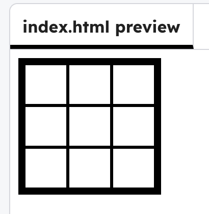

## Make the grid

Start with a 3×3 pixel grid so that you have something to paint on.

In your `index.html` file, add three rows of pixels to create a pixel grid.

You can use copy and paste to save time.

```html filename="index.html" line_numbers="true" line_number_start="5" line_highlights="6-22"
<body>
  <div id="artboard">
    <div class = "row">
      <div class="pixel"></div>
      <div class="pixel"></div>
      <div class="pixel"></div>
    </div>
    <div class = "row">
      <div class="pixel"></div>
      <div class="pixel"></div>
      <div class="pixel"></div>
    </div>
    <div class = "row">
      <div class="pixel"></div>
      <div class="pixel"></div>
      <div class="pixel"></div>
    </div>
  </div>
</body>

```

## Now run your code

Check the 3×3 grid.


