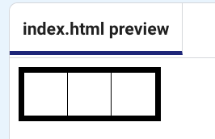

<h2 class="c-project-heading--task">Add a row of pixels</h2>

--- task ---
➡️ Add a row of three pixels inside the art div.
--- /task --- 

--- code ---
---
filename: index.html
language: html
line_numbers: true
line_number_start: 7
line_highlights: 9-13
---
<body>
  

    

      

      

      

    

  
  
</body>

--- /code ---

Switch to the `style.css` file and add the styles for rows and pixels:

--- code ---
---
filename: style.css
language: css
line_numbers: true
line_number_start: 8
---
.row {
  display: table-row;
}

.pixel {
  display: table-cell;
  background-color: white;
  width: 40px;
  height: 40px;
  border: 1px solid black;
}

--- /code ---

### Tip
You have used a class instead of an ID to style the row and pixel divs. This is because there will be lots of them.

**Test:** Run your code to see the row of pixels.

