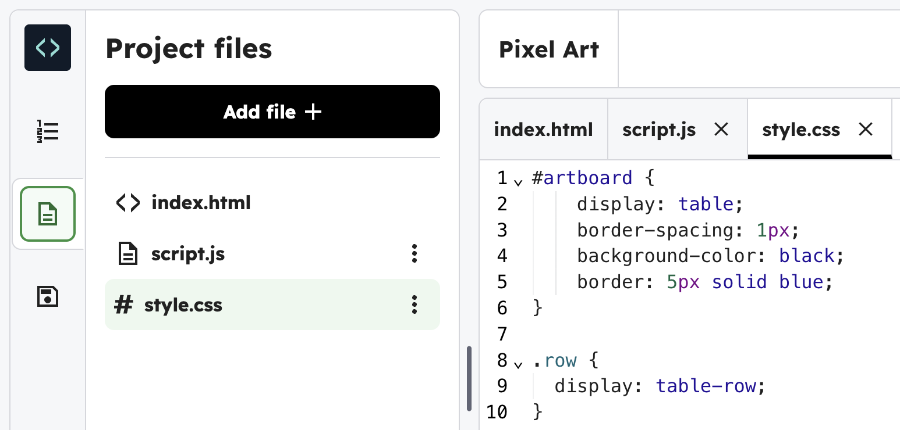
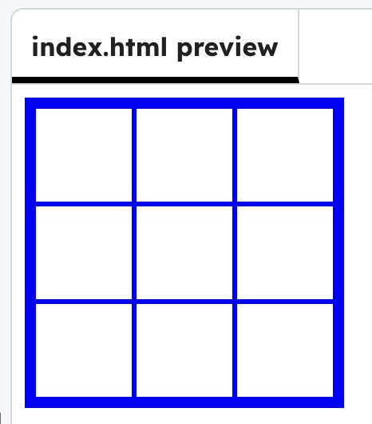

<h2 class="c-project-heading--task">Style the grid</h2>

In `style.css`, add styles for `#artboard`, `.row`, and `.pixel`.

## Step 1

Click on the **Project files** icon, then the `style.css` file.

## Step 2

The pixels show as white squares inside a black border. Experiment with colours, and change the `width` and `height` to get the artboard to look how you want it to.

### Tip

You can find [more CSS colour names here](http://jumpto.cc/colours){:target="_blank"}.

--- code ---
---
language: css
filename: style.css
line_numbers: true
line_number_start: 1
line_highlights: 4-5, 15-17
---
#artboard {
  display: table;
  border-spacing: 1px;
  background-color: blue;
  border: 5px solid blue;
}

.row {
  display: table-row;
}

.pixel {
  display: table-cell;
  background-color: white;
  width: 60px;
  height: 60px;
  border: 1px solid blue;
}
--- /code ---

## Now run your code

You should see your **3×3** grid change with your new sizes and colours.

