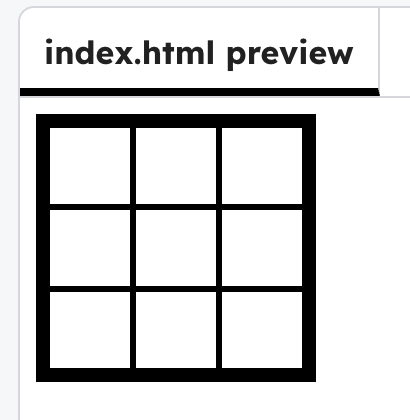

<h2 class="c-project-heading--task">Make the grid</h2>

--- task ---

Start with a 3×3 pixel grid so you have something to paint on.

--- /task --- 

--- task ---

In your `index.html` file, add three rows of pixels to create a pixel grid. 

You can use copy and paste to save time.

--- /task --- 

--- code ---
---
filename: index.html 
language: html
line_numbers: true
line_number_start: 5
line_highlights: 6-22
---
<body>
  

    

      

      

      

    

    

      

      

      

    

    

      

      

      

    

  
  
</body>

--- /code ---

--- task --- 

**Test:** Run your code to see the 3x3 grid.

--- /task --- 

