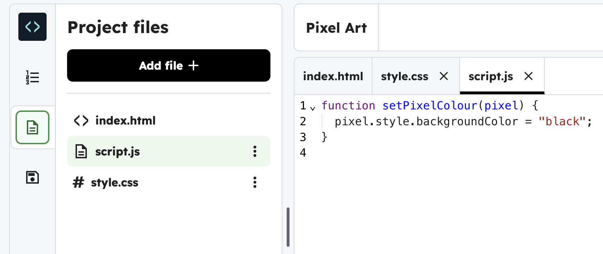
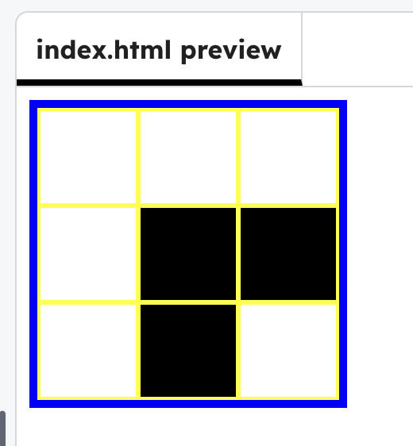

## Make the grid clickable

Make pixels change colour when you click on them.

## Step 1

Click on the **Project files** icon and open `script.js`.



## Step 2

Add the code below to find every `.pixel` and turn it black when clicked.

```javascript filename="script.js" line_numbers="true" line_number_start="1" line_highlights="5-13"
function setPixelColour(pixel) {
  pixel.style.backgroundColor = "black";
}

document.addEventListener("DOMContentLoaded", () => {
  const pixels = document.querySelectorAll(".pixel");

  pixels.forEach((pixel) => {
    pixel.addEventListener("click", () => setPixelColour(pixel));
  });
});
```

## Now run your code

Click on a few pixels and they should turn **black**.


