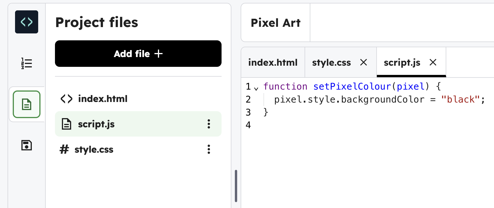
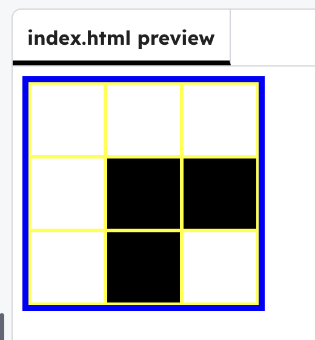

<h2 class="c-project-heading--task">Make the grid clickable</h2>

--- task ---

Make pixels change colour when you click them.

--- /task ---

--- task ---

Click the file icon and open `script.js`.

--- /task ---

--- task ---

Add the code below that finds every `.pixel` and turns it black when clicked.

--- /task ---

--- code ---
---
language: javascript
filename: script.js
line_numbers: true
line_number_start: 1
line_highlights: 5-13
---
function setPixelColour(pixel) {
  pixel.style.backgroundColor = "black";
}

document.addEventListener("DOMContentLoaded", () => {
  const pixels = document.querySelectorAll(".pixel");

  pixels.forEach((pixel) => {
    pixel.addEventListener("click", () => setPixelColour(pixel));
  });
});
--- /code ---

--- task ---

**Test:** Run your project — click a few pixels and they should turn **black**.

--- /task ---

