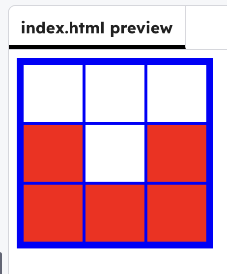

<h2 class="c-project-heading--task">Change the paint colour</h2>

Change the colour you paint by editing one line of JavaScript.

<h2 class="c-project-heading--explainer">Follow these instructions</h2>

In `script.js`, change the colour so pixels paint **red** instead of black.

--- code ---
---
language: javascript
filename: script.js
line_numbers: true
line_number_start: 1
line_highlights: 2
---
function setPixelColour(pixel) {
  pixel.style.backgroundColor = "red";
}

document.addEventListener("DOMContentLoaded", () => {
  const pixels = document.querySelectorAll(".pixel");

  pixels.forEach((pixel) => {
    pixel.addEventListener("click", () => setPixelColour(pixel));
  });
});
--- /code ---

## Now run your code

Click pixels and they should now turn **red**. Experiment with adding other colours.

