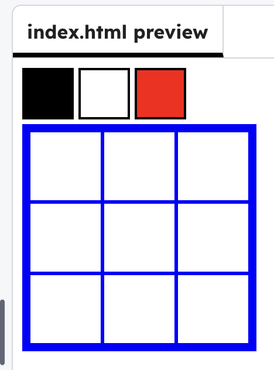

<h2 class="c-project-heading--task">Add a palette</h2>

Add a colour palette above your grid so you can choose colours later.

<h2 class="c-project-heading--explainer">Follow these instructions</h2>

In `index.html`, add a `palette` div above the `artboard`.

--- code ---
---
language: html
filename: index.html
line_numbers: true
line_number_start: 4
line_highlights: 6-10
---
</head>
<body>
    

      

      

      

    

  

--- /code ---

### Tip

The pixels will only change to red for now.

## Now run your code

You should see **three squares** above the grid. This is your pallette.

