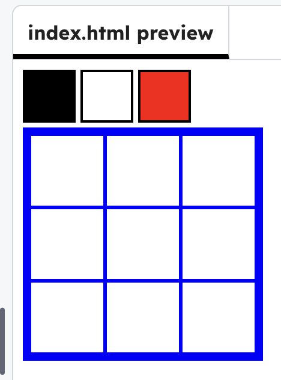

## Add a palette

Add a colour palette above your grid so that you can choose colours later.

In `index.html`, add a `palette` `<div>` above the `artboard`.

```html filename="index.html" line_numbers="true" line_number_start="4" line_highlights="6-10"
</head>
<body>
    <div id="palette">
      <div class="pen" data-colour="black" style="background-color: black;"></div>
      <div class="pen" data-colour="white" style="background-color: white;"></div>
      <div class="pen" data-colour="red" style="background-color: red;"></div>
    </div>

  <div id="artboard">
```

> [!TIP]
>
> For now, the pixels will only change to red.

## Now run your code

You should see **three squares** above the grid. This is your palette.


