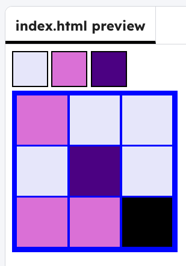

<h2 class="c-project-heading--task">Pick the paint</h2>

--- task ---

Change the colours so the palette has colours that you like

--- task ---

--- code ---
---
language: html
filename: index.html
line_numbers: true
line_number_start: 1
line_highlights: 11-17
---
    

      

      

      

    

--- /code ---

--- task ---

**Test:** Run your project — you should see your palette change.

--- /task ---

