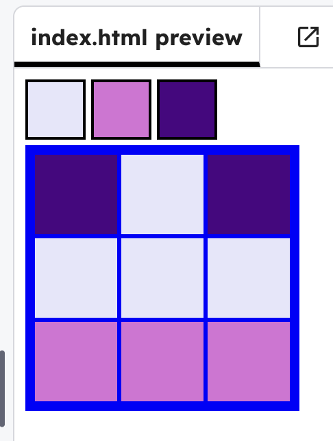

## Choose a palette colour

Change the code so that you can click on a square in the palette to choose a colour, then use that colour to paint pixels.

Update `script.js` so that clicking on a colour sets `penColour`, and clicking on a pixel uses `penColour`.

```javascript filename="script.js" line_numbers="true" line_number_start="1" line_highlights="1,4,14-20"
let penColour = "black";

function setPixelColour(pixel) {
  pixel.style.backgroundColor = penColour;
}

document.addEventListener("DOMContentLoaded", () => {
  const pixels = document.querySelectorAll(".pixel");

  pixels.forEach((pixel) => {
    pixel.addEventListener("click", () => setPixelColour(pixel));
  });

  const pens = document.querySelectorAll(".pen");

  pens.forEach((pen) => {
    pen.addEventListener("click", () => {
      penColour = pen.dataset.colour;
    });
  });
});
```

## Now run your code

Click on a colour, then click on pixels to paint with that colour.


