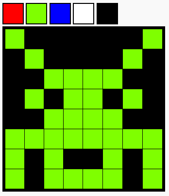

## Challenges

Upgrade your project with some challenges.

> [!CHALLENGE]
>
> ## Make a bigger grid
>
> Increase the size of your grid to 8×8.
>
> You need to work out how to make one row of 8, and then copy it to make 7 more rows.

> [!CHALLENGE]
>
> ## Add more colours to the palette
>
> Add another colour with the line of code below. Then, create some colourful pixel images!
>
> ```html filename="index.html"
>
> <div class="pen" data-colour="blue" style="background-color: blue;"></div>
>
> ```

Here is an example of a design with a bigger grid:



## Now run your code

Try your challenges and check the changes in your pixel art.
