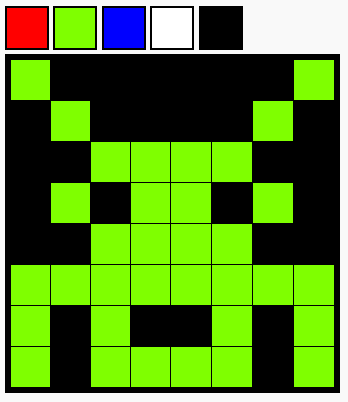

<h2 class="c-project-heading--task">Challenges</h2>

--- task ---

Upgrade your project with some challenges.

--- /task --- 

--- task ---

**Make a bigger grid.**

Increase the size of your grid to 8x8

--- /task --- 

### Tip
You need to work out how to make one row of eight and then copy it to make seven more rows.

--- task ---

**Add more colours to the palette.**

Add another colour with the line of code below. Then create some colourful pixel images!

--- code ---
---
language: html
filename: index.html
line_numbers: false
---

 

--- /code ---

--- /task --- 

Here is an example of a design with a bigger grid

